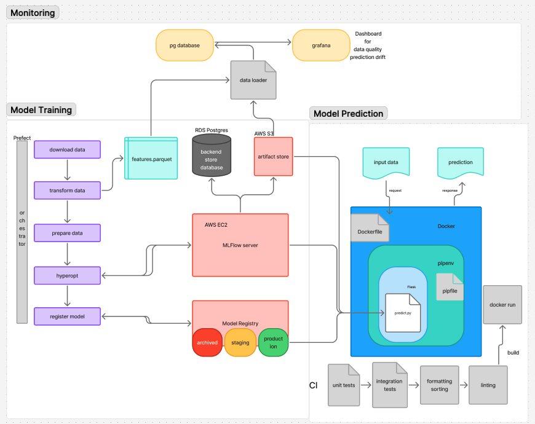

# Monthly-Stock-Return-Prediction
 MLOps project: using ML model to predict monthly return in the beginning of the month. 

# Project Overview


# Description
Problem: 
stock return prediction using machine learning model is widely used. 
usually, researchers run models in python notebook with conda environment. 
it works fine until the data source getting bigger, and the python notebook grows to 10MB.
How MLOps helps:
That is when to bring in MLOps, setup model training pipeline, register models clearly,
with proper prediction drift monitoring, and model deployed in cloud. 
That way, researchers works easier without messy and big python notebook.
But they can still work in python notebook. 

# Technical Stack
Python
MLFlow
AWS EC2, RDS, S3
Prefect
Evidently

# Modules
## Model Training
see model_training folder
training machine learning models and register into mlflow registry.
pipeline includes download data, transform data, prepare data, hyperopt training and registering.
prefect orchestrate all tasks

## Model Prediction
see model_prediction folder
predict function, fetch models from mlflow server if alive, else fetch from S3 artifact store 
it loads models and artifacts, using input data to return prediction.
the predict function then wrapped with flask app, and then put into docker image 

## Monitoring
see monitoring folder
it spin up a postgres database, adminer, grafana and a dataloader.
data loader is a python script wrapped in docker to load data into postgres database. 
grafana is a dashboard to see data quality and prediction drift.

## Testing
see model_prediction/tests folder
in model_prediction/run.sh
1, export environment variables, 
2, build the flask app image if not built, 
3, spin up localstack to mock s3, 
4, build test container
5, configure localstack
6, run test container for unit tests
7, run flask app container
8, run test container for integration test
9, clean up

## Deploy
i deployed to the flask app container to azure
```
curl -X POST http://predict-app.eastus.azurecontainer.io:8080/predict \
 -H "Content-Type: application/json" \
 -d @json_records.json
```
json_records.json is the feature example, it includes hundreds of records.
feel free to copy only one of them and passed into flask app.
change the last line to
 `--data "$(jq '.[0]' json_records.json)"`
 if you have jq installed. 
 feel free to adjust the index number.